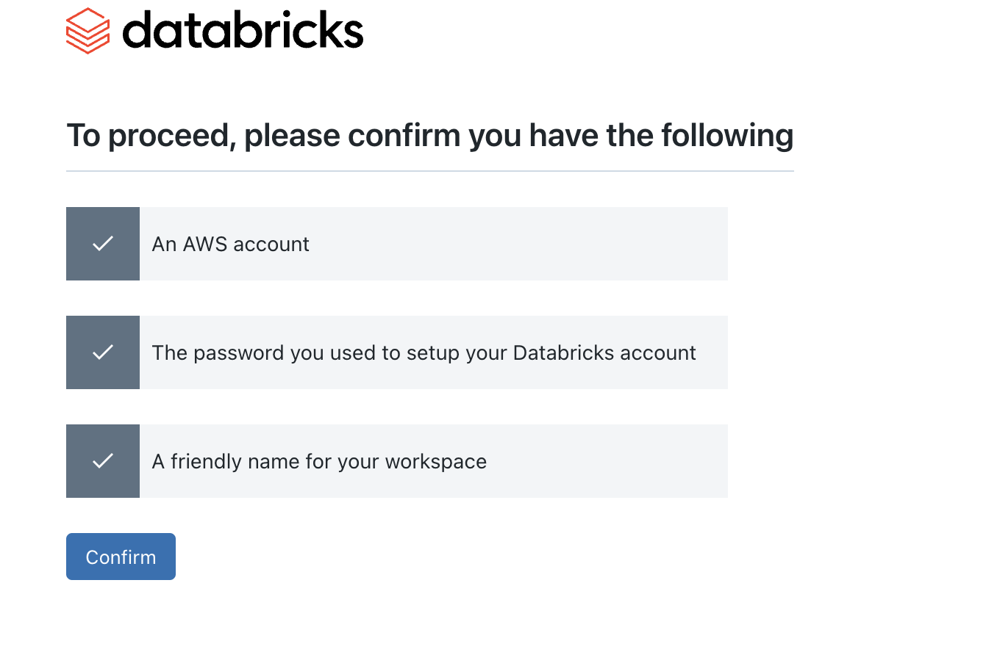

- go to databricks website
    - https://www.databricks.com/try-databricks#account
- fill details
    - 
- choose a provider (AWS)
    - 
    
https://pages.databricks.com/TY-StandardTrial.html
    - admin guide 
    - quick start guide - https://docs.databricks.com/en/getting-started/index.html#set-up-your-account-and-workspace

- verify your email
- set password
- 
- select the most popular plan as we need sql and streaming
- REMEMBER ITS ONLY 14 DAYS FREE TRIAL

- Once you signin to your AWS root user account, you will see the following screen

- Put your databricks password

- click on create stack

- while this is done, you will see the workspace in the databricks website
- https://accounts.cloud.databricks.com/workspaces

- it will take around 8-10 minutes to create the stack,
- once it is done, you will see the following screen in our databricks workspace

- click on open , on the right side, and it will open the databricks workspace
- you will get a new window like this,

- Lets click on start warehouse
- it will take around 20 minutes to start the warehouse
- 

- if you click on dataingestion on the left hand side, 

- if you go to query editor, you can see the following

- on the left if you click on new, you will see the notebook option

- when you run your notebook with `print("hello world")`

- you will see the above, just click create and run 
- it will take 10 minutes to run for the first time, as it need to create a new compute instance
- if you click on the three dots, you will see an option to import
- 

## lets continue the video, 
- i wasnt able to read a csv,

so i imported a notebook from examples and tested it

https://docs.databricks.com/en/machine-learning/feature-store/example-notebooks.html