## 01. Databricks: Spark Architecture & Internal Working Mechanism

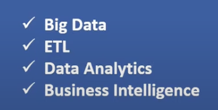
- We will be seeing spark Architecture and Internal working mechanism in this lecture.
- its highly recommended for a data bricks developer to know the spark architecture and internal working mechanism.
- it's not possible to develop a high performance spark application without knowing the spark architecture and internal working mechanism.
- What is Spark?
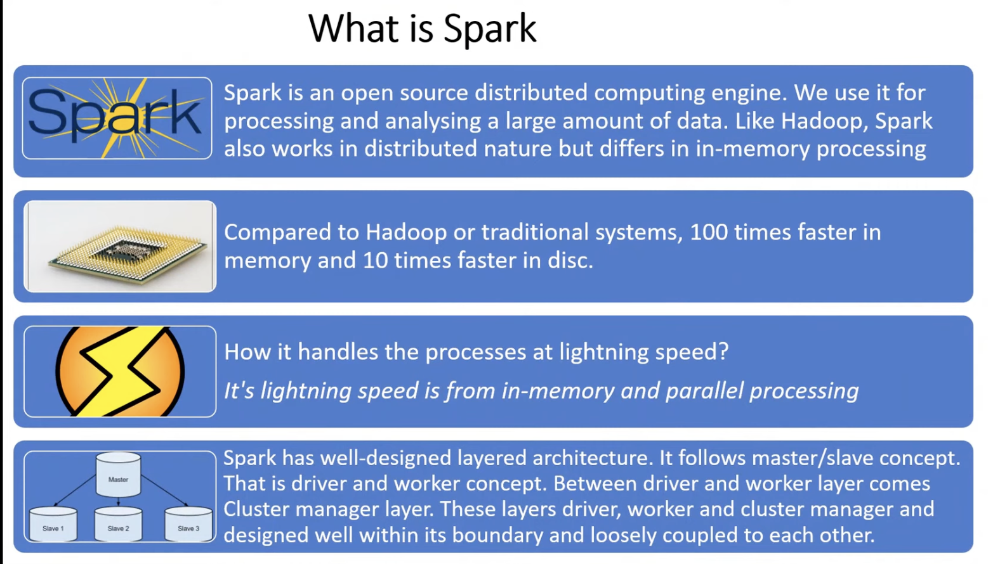
    - open source
    - Distributed framework
        - distributed means, it can run on multiple machines in a cluster environment.
        - because of this distributed nature, it can process huge amount of data.
            - it can process terabytes and petabytes of data.
            - how does the distributed architecture work?
                - it will divide the data into multiple partitions and process each partition in parallel.
                - this is called parallel processing.
                - this is the reason why spark is very fast.
                - refer this video for more details on parallel processing.
                    - https://www.youtube.com/watch?v=IJWwfMyPu1c
                - refer this for quick and short explanation on system design
                    - https://www.youtube.com/playlist?list=PLJq-63ZRPdBt423WbyAD1YZO0Ljo1pzvY
                
        - cluster means, multiple machines connected to each other.
        - cluster can be on-premises or cloud.
        - cluster can be managed by a cluster manager like yarn, mesos, kubernetes, spark standalone cluster manager.
        - cluster manager is responsible for managing the cluster resources.
    - if we want to process millions of records with lightening speed, then we need to use spark.
    - spark works similar to hadoop in terms of distributed processing.
    - but it is completely different from hadoop in terms of storage., as it works on in-memory model, but hadoop adopts in-disk based storage model. 
    - Spark is atleast 100 times faster in memory and 10 times faster on disk than hadoop or traditional system.
    - Why ?
        - because of in-memory processing.
            - in-memory processing means, it will store the data in memory and process it., so it will be very fast.we dont need to read the data from disk. 
            - in memory is like , telling a phone number that is in our mind, we dont need to go to our contacts and search for the number.
            - disk is like, telling a phone number that is in our contacts, we need to go to our contacts and search for the number.
            - that is the reason why in-memory processing is very fast.
        - parallel processing
            - distributed processing means, it will divide the data into multiple partitions and process each partition in parallel.
            - for threading, concurrency, parallelism refer this video
                - https://www.youtube.com/watch?v=olYdb0DdGtM
            - in traditional system, the data will be stored in a single machine, so it will be very slow.
            - it will talk to disc for every operation.
            - but in spark, the data will be stored in multiple machines, so it will be very fast.
            - there are multiple worker nodes in spark and data is also distributed across multiple worker nodes.and each and every worker node will process the data in parallel.and work independently.
            - and within worker node we will have multiple executors and within executors we will have multiple cores and each and every core will process the data in parallel.
            - to construct a building , if we deploy 1 workers it will take 1 year, if we deploy 10 workers it will take 1 month, if we deploy 100 workers it will take 1 day.
            - so if we want to process huge amount of data, we need to deploy more workers.
            - in traditional system ,there will be only one worker, but in spark we can have multiple workers.
            - we can dynamically increase or decrease the number of workers based on the data size through cluster manager. and distribute the data across multiple workers.
        - It follows master slave concept
            - refer https://www.youtube.com/watch?v=xPqI6OOvXvs
            - master is responsible for managing the cluster resources.
        - it is layered architecture
            - there are three modes,
                - driver
                - cluster manager
                - worker node
            - these three are very well connected with each other., and is loosely coupled.
    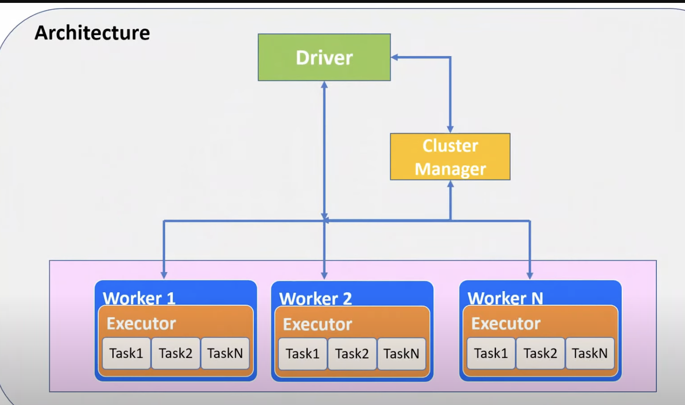
    - https://youtu.be/4JP0XqsjwCI?list=PLgPb8HXOGtsQeiFz1y9dcLuXjRh8teQtw&t=444
    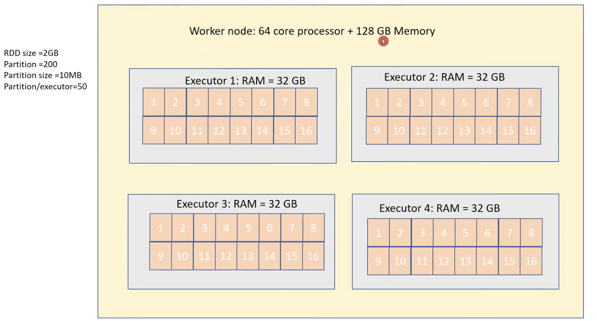
    - performance tuning
    - https://youtu.be/4JP0XqsjwCI?list=PLgPb8HXOGtsQeiFz1y9dcLuXjRh8teQtw&t=624
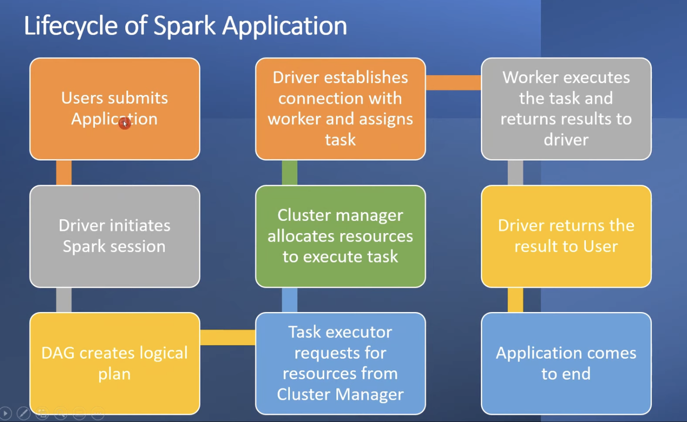
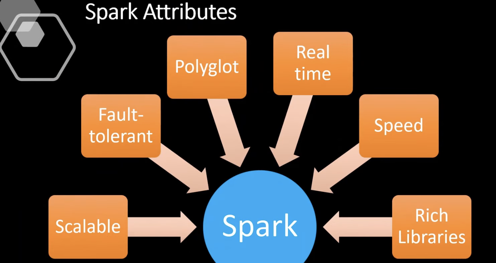
- scalabel means, we can increase or decrease the number of workers based on the data size.
- fault tolerant means, if any worker node fails, then the cluster manager will automatically restart the worker node and reprocess the data.
    - lazy evaluation model, means, it will not process the data until we call an action.
- Polyglot
    - it supports multiple languages like python, scala, java, R.
    - we can use any language to develop spark application.
    - but scala is the best language to develop spark application.
- Speed
    - in=memory processing
    - parallel processing
- rich library
    - it has rich library for machine learning, graph processing, streaming, sql, etc.
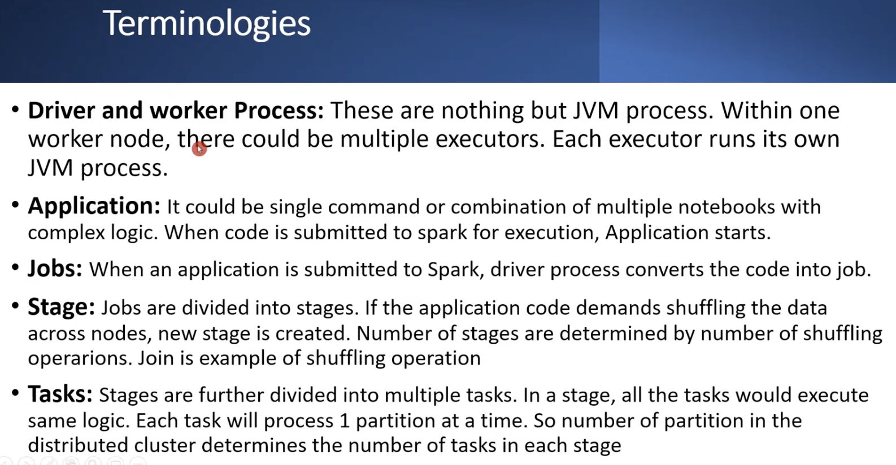
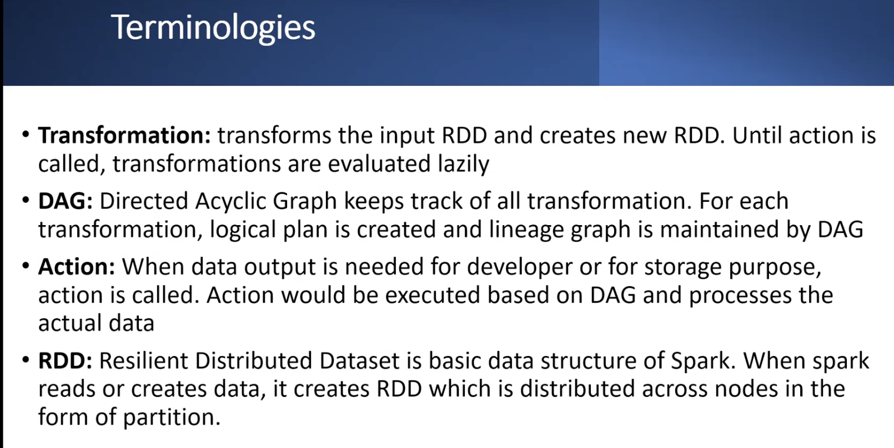
    - rdd means, resilient distributed dataset.
    - it is the core abstraction of spark., it is the inbuilt data structure of spark.
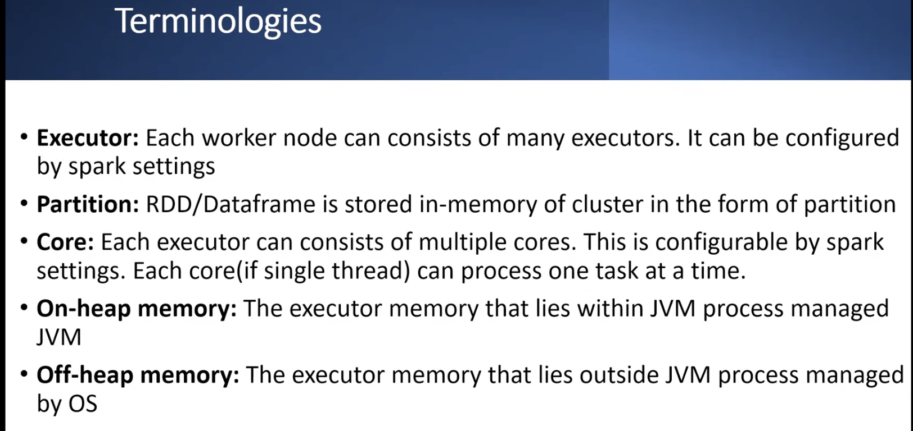
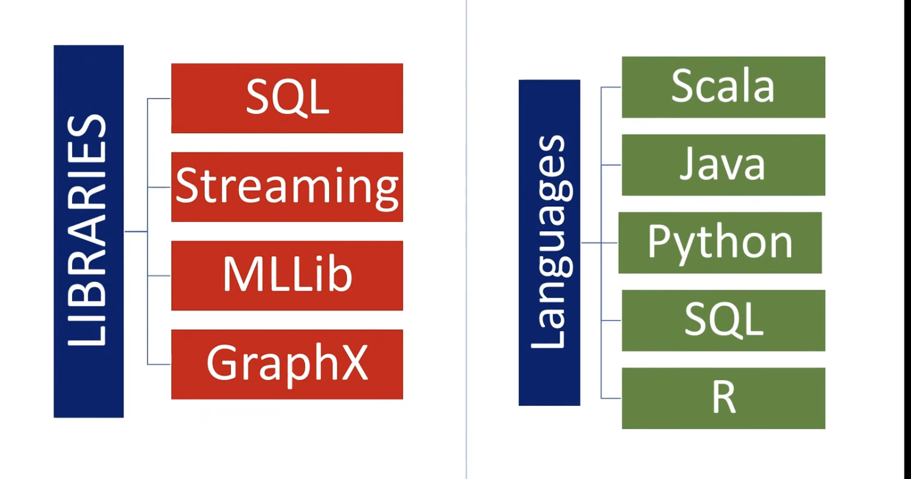
- graphx is used for graph processing.
    - graph processing means, it will process the data in the form of graph.
    - for social media applications, we need to process the data in the form of graph.
- one notebook is one spark application.
- we can mix languages in a single notebook. for which we need to use magic commands.
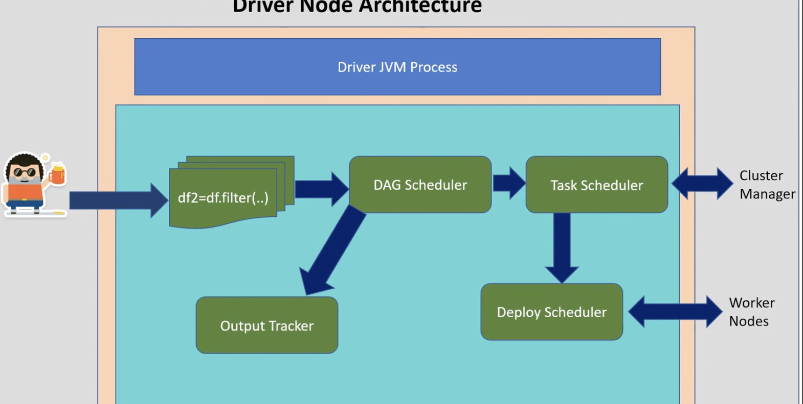
- https://youtu.be/4JP0XqsjwCI?list=PLgPb8HXOGtsQeiFz1y9dcLuXjRh8teQtw&t=1739
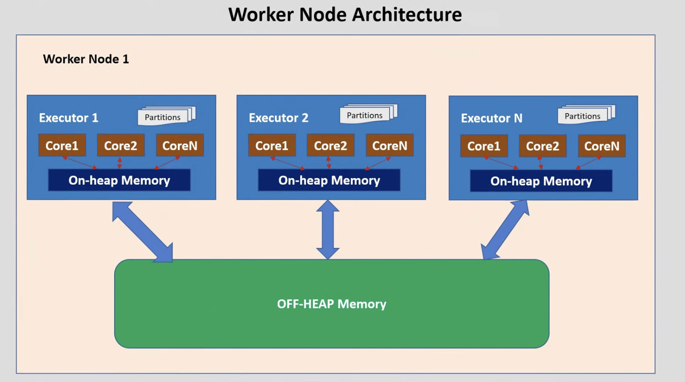
    - off heap memory means, it will store the data in the memory of the worker node.
    - off heap memory is used for caching.we dont need to serialize and deserialize the data.
    - garbage collection is not required for off heap memory.
- 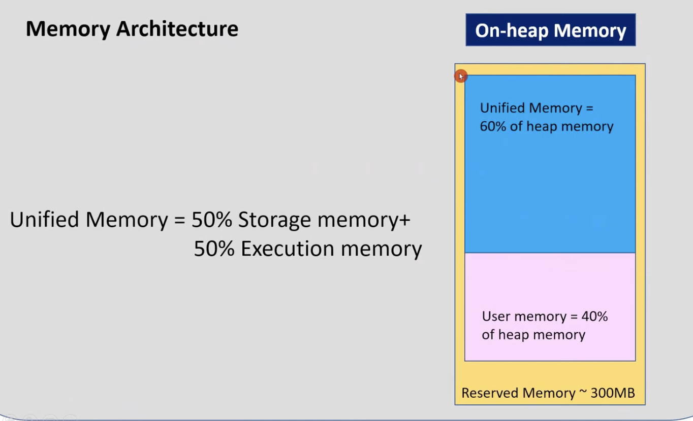
    - reserved memory means, it will reserve some memory for the system.
        - we cannot use this memory for spark processing.
    - user memory means, it will reserve some memory for the user.
        - we can use this memory for spark processing.
    - unified memory means, it will reserve some memory for the system and user.
        - we can use this memory for spark processing.
        - storage memory means, it will reserve some memory for caching.
        - execution memory means, it will reserve some memory for processing.
        - we can configure the memory size for each and every memory type.
    - ML algorithms need more execution memory., so we need to increase the execution memory.
    - we can use 80% of the memory for spark processing and 20% of the memory for the system.
    - it can be configured in spark configuration, like spark.executor.memory=4g
## DEMO
    - https://youtu.be/4JP0XqsjwCI?list=PLgPb8HXOGtsQeiFz1y9dcLuXjRh8teQtw&t=2230
    - Now he will show some demo on databricks.
    - before that we need to know how to use databricks in any cloud platform